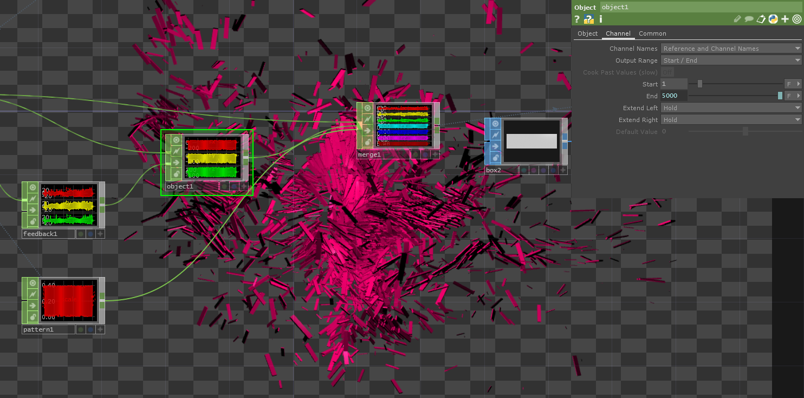

# instancing_3

## Tips
- About object TOP, it's important to change the start / end value type from `Second` to `Frame` in Channel tab to avoid performance issue

## Reference
http://www.indaehwang.com/touchdesigner/example-with-particle-sop-in-touchdesigner/