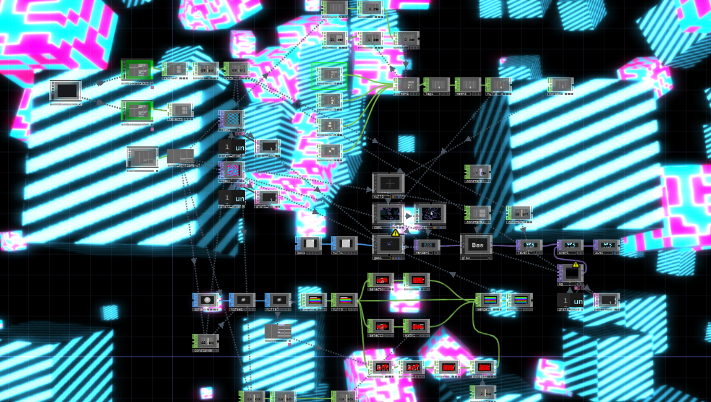
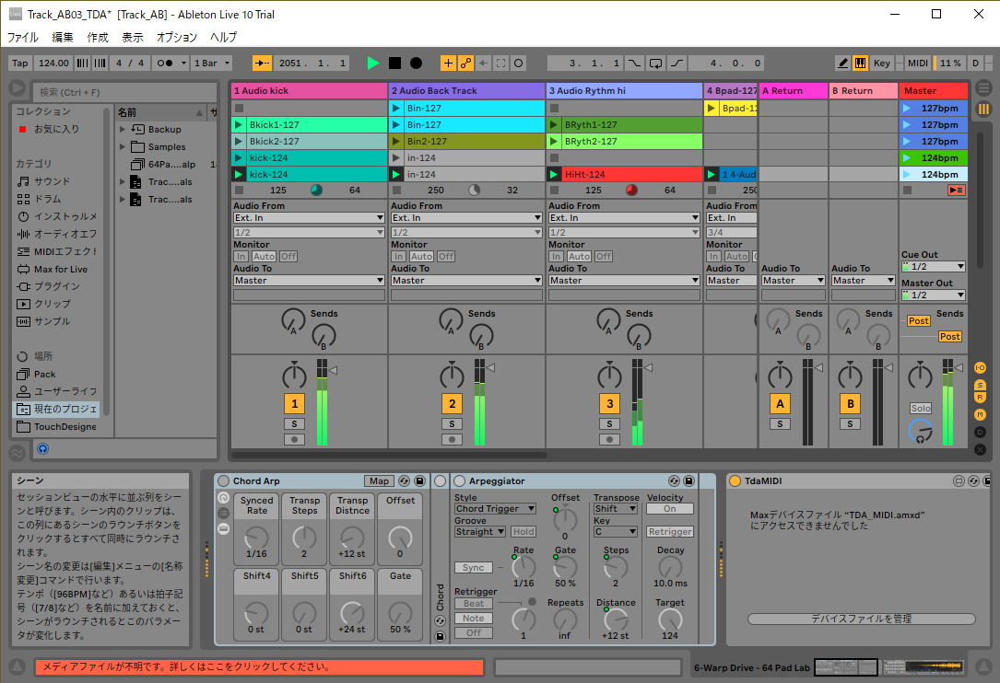

# ableton_live_midi_1
- Audio vidual using TDAbleton
- Use midi controller

## TouchDesigner

## Ableton Live

- Play master track which has `Audio kick` since TDAbleton in this project refers to `Audio kick`.